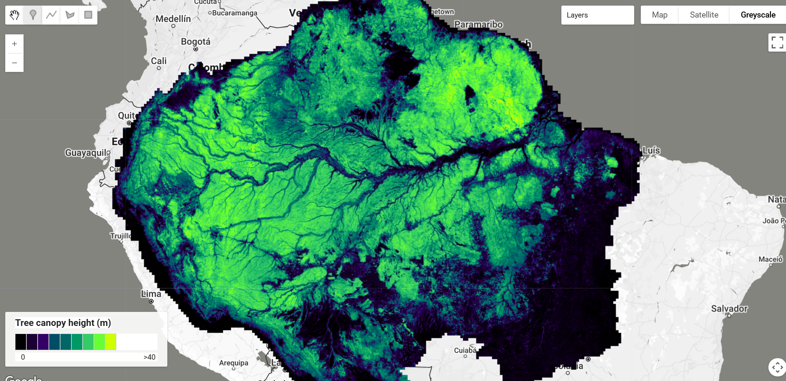

# High Resolution Amazon Canopy Tree Height Dataset

<div class="result" markdown>

???+ note

    **This dataset is part of a paper that is currently in revision and has been submitted for publication to Remote Sensing for Ecology and Conservation. Please keep this in mind while utilizing the data downstream. The status and citation will be updated accordingly**

</div>

This dataset provides high-resolution (~4.78 m) tree canopy height for the Amazon forest for the period 2020-2024. It was generated using a U-Net deep learning model adapted for regression, trained with Planet NICFI satellite images and informed by LiDAR-derived canopy height models (CHMs). The model predicts mean tree canopy height and has demonstrated a mean error of 3.68 m in validation samples, successfully estimating canopy heights up to 40-50 m with relatively low systematic bias. The study determined that the Amazon forest has an average canopy height of approximately 22 m. You can find additional information [in the preprint](https://arxiv.org/abs/2501.10600)

#### Key Features and Details

**Dataset Title:** High Resolution Tree Height Mapping of the Amazon Forest

**Spatial Resolution:** ~4.78 meters

**Temporal Coverage:** Composite for 2020-2024. The model was trained using Planet NICFI images from 2015-12-01 to 2024-06-01 and LiDAR data collected between 2008 and 2018. The final Amazon forest map is a mean for the period 2020-2024.

**Coverage:** Amazon forest domain (approximately 8,260,920 km²)

**Methodology:** U-Net deep learning model adapted for regression, using 4-band (RGB-NIR) Planet NICFI images as input. The model was trained with Canopy Height Models (CHMs) derived from airborne LiDAR data as reference.

**Accuracy:** Mean Absolute Error (MAE) of 3.68 m on validation samples. The model estimates heights up to 40-50 m without significant saturation.

**Data Format:** The Earth Engine asset stores height values that are scaled by a factor of 2.5. To obtain the actual height in meters, the pixel values in the asset must be divided by 2.5. The original CHM was multiplied by 2.5 and saved as integer 8 bits.

**Mean Amazon Canopy Height:** Estimated at ~22.09 m

#### Data Sources

**Satellite Imagery:** Planet NICFI (Norway's International Climate and Forest Initiative) images (Red, Green, Blue, Near-Infrared bands) at ~4.78 m spatial resolution.

**Reference Data (LiDAR):**
- Brazilian Agricultural Research Corporation (Embrapa) - "Sustainable Landscapes Brazil" Program (2015-2018)
- National Institute for Space Research (INPE, Brazil) - EBA (Biomass Estimation of the Amazon) project (2016-2018)
- São Paulo City Hall (Brazil) - LiDAR dataset covering the São Paulo Metropolitan Region (2017)

**Building Footprints (for masking):** Google Open Buildings dataset for South America

#### Citation

```
Wagner, Fabien H., Ricardo Dalagnol, Griffin Carter, Mayumi Hirye, Shivraj Gill, Le Bienfaiteur Sagang Takougoum, Samuel Favrichon et al. "High Resolution Tree Height Mapping of
the Amazon Forest using Planet NICFI Images and LiDAR-Informed U-Net Model." arXiv preprint arXiv:2501.10600 (2025).
```

#### Dataset Preprocessing for Earth Engine

The datasets are distributed over 22,063 tiles which were downloaded and a mosaiced product was created for ingest. The scale can be applied in code and was added as a property to the image along with the units. As a result of the mosaic operation the tile naming convention with traceability back to the image was removed as a result of which the grid was added as a separate asset for allow traceability back to individual tiles.



#### Earth Engine Snippet

```js
var amazonCanopyHeight = ee.Image("projects/sat-io/open-datasets/CTREES/AMAZON-CANOPY-TREE-HT");
var amazonCanopyHeight_tiles = ee.FeatureCollection("projects/sat-io/open-datasets/CTREES/CTREES-AMAZON-TILE-LOCATOR")
```

Sample Code: https://code.earthengine.google.com/?scriptPath=users/sat-io/awesome-gee-catalog-examples:agriculture-vegetation-forestry/CTREES-AMAZON-CANOPY-TREE-HT

#### License
The underlying Planet NICFI satellite imagery is available for non-commercial purposes under specific agreements with [Planet and Norway's International Climate and Forest Initiative](https://planet.widen.net/s/zfdpf8qxwk/participantlicenseagreement_nicfi_2024). The LiDAR datasets used for training have their own respective licenses, generally public or available for research.

Provided by: Wagner et al 2025, ctrees.org

Curated in GEE by: Samapriya Roy

Keywords : Canopy Height, Amazon Forest, Tree Height, Remote Sensing, Deep Learning, U-Net, Planet NICFI, LiDAR, Tropical Forests, Forest Structure

Last updated in GEE: 2025-06-04
