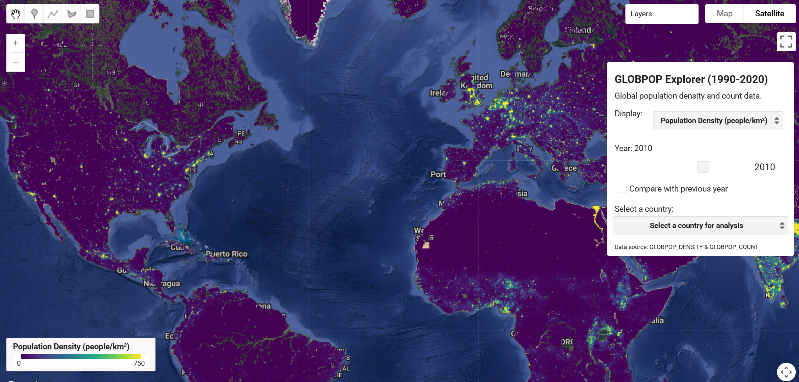

# GlobPOP Global Gridded Population Dataset

GlobPOP is a continuous high-resolution global gridded population dataset covering the period from 1990 to 2020 with annual time steps. Developed by the State Key Laboratory of Remote Sensing Science at Beijing Normal University, this dataset provides population count and density information at a 30 arc-second (approximately 1 km at the equator) resolution. GlobPOP is derived from a data fusion framework based on cluster analysis and statistical learning approaches, which integrates five existing global gridded population datasets: GHS-POP, GRUMP, GPWv4, LandScan, and WorldPop. The fusion methodology enhances consistency for time-series analysis through spatial-temporal validation, making it particularly valuable for applications in sustainable development, epidemiology, urban planning, environmental management, risk assessment, and tracking progress toward the Sustainable Development Goals (SDGs).



#### Dataset Details

| Characteristic  | Description                                                    |
|-----------------|----------------------------------------------------------------|
| Name            | GlobPOP                                                        |
| Provider        | State Key Laboratory of Remote Sensing Science, Beijing Normal University |
| Resolution      | 30 arc-seconds (approximately 1 km at the equator)            |
| Coverage        | Global (90°N to 90°S)                                          |
| Temporal Range  | 1990-2020 (annual)                                             |
| Available Formats | Population Count and Population Density                      |
| Data Type       | GeoTIFF (I32/F32)                                              |
| License         | Creative Commons Attribution 4.0 International (CC BY 4.0)     |

#### Notes

!!! info

    - GlobPOP offers high spatial and temporal consistency for time-series analysis of population dynamics
    - The dataset provides both population count (persons per grid cell) and density (persons per square kilometer)
    - The product was validated at both national (217 countries) and sub-national levels using census data
    - The dataset is particularly useful for analyzing long-term population changes and spatial patterns at global, national, and city levels

#### Citation

```
Liu, L., Cao, X., Li, S. & Jie, N. (2024). A 31-year (1990–2020) global gridded population dataset
generated by cluster analysis and statistical learning. Scientific Data, 11, 124.
https://doi.org/10.1038/s41597-024-02913-0
```

#### Dataset Citation

```
Liu, L., Cao, X., Li, S., & Jie, N. (2024). GlobPOP: A 33-year (1990-2022) global gridded population
dataset generated by cluster analysis and statistical learning (2.0) [Data set]. Zenodo.
https://doi.org/10.5281/zenodo.11179644
```

#### Earth Engine Snippet

```js
var popDensityCollection = ee.ImageCollection("projects/sat-io/open-datasets/GLOBPOP_DENSITY");
var popCountCollection = ee.ImageCollection("projects/sat-io/open-datasets/GLOBPOP_COUNT");
```

Sample Script: https://code.earthengine.google.com/?scriptPath=users/sat-io/awesome-gee-catalog-examples:population-socioeconomics/GLOBPOP-COUNT-DENSITY

#### License
The dataset is distributed under a Creative Commons Attribution 4.0 International (CC BY 4.0) license.

Keywords: Population, Demographics, Census, Global, Time-series, Gridded Population, Sustainable Development, Population Density

Produced by: State Key Laboratory of Remote Sensing Science, Beijing Normal University

Curated in GEE by: Samapriya Roy

Last updated on GEE: 2025-05-14
